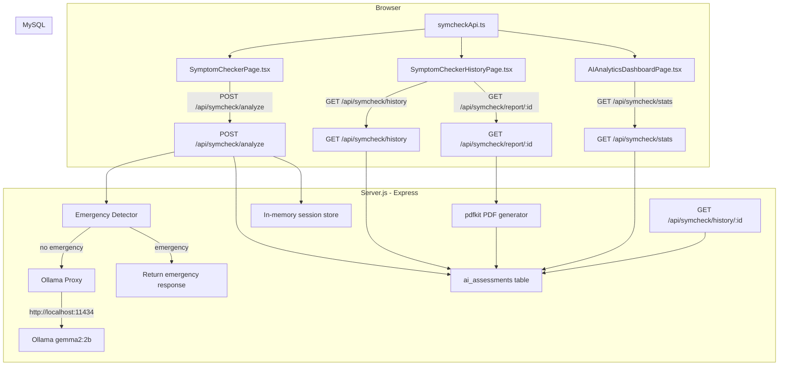

# Design Document

## SymCheck AI Integration

---

## Overview

This design integrates the SymCheckAI symptom-checking capabilities into the existing Healthcare Management System (HMS). The integration adds three new pages, five new backend API endpoints, one new MySQL table, and two new sidebar navigation items — all built to match the existing HMS design system exactly.

The feature is scoped to three user roles:
- **Patient**: Access to the Symptom Checker chat (`/symcheck`) and Assessment History (`/symcheck/history`)
- **Admin / Doctor**: Access to the AI Analytics Dashboard (`/symcheck/dashboard`)

All AI inference is handled by a locally running Ollama instance (`http://localhost:11434`) using the `gemma2:2b` model. The Node.js/Express `Server.js` proxies every Ollama request so the React frontend never communicates with Ollama directly. Session state is held in-memory on the server. Completed assessments are persisted to a new `ai_assessments` MySQL table.

PDF reports are generated server-side using `pdfkit` (npm package). Analytics charts are rendered client-side using `recharts` (npm package).

---

## Architecture



### Key Design Decisions

1. **Single Server.js file**: All new backend routes are added to the existing `Server.js` following the established pattern of inline route handlers. No new server files are created.
2. **In-memory sessions**: Conversation sessions are stored in a `Map` keyed by `sessionId` (UUID). Sessions are deleted when an assessment completes or when the patient starts a new chat. This matches the approach in the reference `app.py`.
3. **No direct Ollama access from frontend**: The frontend only calls `/api/symcheck/*` endpoints. Ollama's URL never appears in frontend code.
4. **pdfkit for PDF generation**: Added as an npm dependency. PDF is streamed directly from the Express response — no temp files written to disk.
5. **recharts for charts**: Added as an npm dependency. Chosen for its React-native API and compatibility with the existing React 18 + TypeScript + Vite stack.
6. **Emergency detection runs server-side first**: The keyword scan happens in the Express handler before any Ollama call, ensuring no LLM latency for emergencies.

---

## Components and Interfaces

### New Pages

#### `src/pages/SymptomCheckerPage.tsx`

Patient-only chat interface. Follows the standard HMS page layout.

```
SymptomCheckerPage
├── <Navbar />
├── <Sidebar />
└── <main className="flex-1 overflow-y-auto">
    └── <div className="py-6"><div className="max-w-7xl mx-auto px-4 sm:px-6 md:px-8">
        ├── Page header (Brain icon + "Symptom Checker" title)
        ├── Disclaimer banner (yellow/amber bg-amber-50 border-amber-200)
        ├── Chat container (bg-white rounded-xl shadow-md overflow-hidden)
        │   ├── Message thread (scrollable, flex-col)
        │   │   ├── UserMessage component (right-aligned, bg-blue-600 text-white)
        │   │   ├── BotMessage component (left-aligned, bg-gray-100)
        │   │   ├── TypingIndicator component (animated dots, shown while loading)
        │   │   └── AssessmentCard component (shown when diagnosis_ready=true)
        │   │       ├── Diagnosis text
        │   │       ├── UrgencyBadge (inline-flex px-2 text-xs leading-5 font-semibold rounded-full)
        │   │       ├── Confidence percentage
        │   │       ├── Home remedies list
        │   │       ├── Recommended actions list
        │   │       ├── Disclaimer text
        │   │       └── "Save Assessment" button
        │   └── Input area
        │       ├── <textarea> for symptom input
        │       └── Send button (bg-blue-600)
        ├── EmergencyModal (full-screen overlay, shown when emergency detected)
        │   ├── Red alert header
        │   ├── Condition name
        │   ├── Immediate actions list
        │   └── "I Understand - Call 911" acknowledge button
        └── "Start New Chat" button (top-right of chat container)
```

**Local state:**
```typescript
interface ChatMessage {
  id: string;
  role: 'user' | 'bot';
  content: string;
  timestamp: Date;
  isAssessment?: boolean;
  assessment?: AssessmentResult;
}

interface SymptomCheckerState {
  messages: ChatMessage[];
  sessionId: string;
  inputText: string;
  isLoading: boolean;
  showEmergencyModal: boolean;
  emergencyData: EmergencyResponse | null;
  savedAssessmentId: number | null;
}
```

#### `src/pages/SymptomCheckerHistoryPage.tsx`

Patient-only assessment history list and detail view.

```
SymptomCheckerHistoryPage
├── <Navbar />
├── <Sidebar />
└── <main className="flex-1 overflow-y-auto">
    └── <div className="py-6"><div className="max-w-7xl mx-auto px-4 sm:px-6 md:px-8">
        ├── Page header (ClipboardList icon + "Assessment History" title)
        ├── [if selectedAssessment is null] History list view
        │   └── <div className="bg-white shadow overflow-hidden sm:rounded-md">
        │       └── <ul className="divide-y divide-gray-200">
        │           └── AssessmentListRow (per assessment)
        │               ├── Date/time (text-sm text-gray-500)
        │               ├── Symptom snippet (truncated to 100 chars, text-sm text-gray-900)
        │               ├── Diagnosis (text-sm text-blue-600)
        │               ├── UrgencyBadge
        │               └── Confidence (text-sm text-gray-500)
        └── [if selectedAssessment is set] Detail view
            └── <div className="bg-white rounded-xl shadow-md overflow-hidden">
                ├── Back button
                ├── Full symptom description
                ├── Diagnosis
                ├── UrgencyBadge
                ├── Confidence score
                ├── Home remedies list
                ├── Recommended actions list
                └── "Download PDF" button
```

#### `src/pages/AIAnalyticsDashboardPage.tsx`

Admin/doctor analytics dashboard.

```
AIAnalyticsDashboardPage
├── <Navbar />
├── <Sidebar />
└── <main className="flex-1 overflow-y-auto">
    └── <div className="py-6"><div className="max-w-7xl mx-auto px-4 sm:px-6 md:px-8">
        ├── Page header (BarChart2 icon + "AI Analytics" title)
        ├── Stats row (grid grid-cols-1 gap-5 sm:grid-cols-2 lg:grid-cols-4)
        │   ├── <StatsCard title="Total Assessments" color="blue" />
        │   ├── <StatsCard title="Emergency" color="red" />
        │   ├── <StatsCard title="Urgent" color="amber" />
        │   └── <StatsCard title="Non-Urgent" color="green" />
        └── Charts row (grid grid-cols-1 gap-5 lg:grid-cols-2 mt-8)
            ├── Urgency Breakdown card (bg-white rounded-xl shadow-md)
            │   └── <PieChart> (recharts donut chart)
            │       └── <Pie> with EMERGENCY=red, URGENT=amber, NON-URGENT=green
            └── Confidence Trend card (bg-white rounded-xl shadow-md)
                └── <LineChart> (recharts)
                    ├── <XAxis dataKey="date" />
                    ├── <YAxis domain={[0, 100]} />
                    └── <Line dataKey="confidence" stroke="#2563eb" />
```

### Shared Sub-components

These small components are defined within their parent page files (not separate files) to keep the file count minimal:

- **`UrgencyBadge`**: Renders an `inline-flex px-2 text-xs leading-5 font-semibold rounded-full` badge. Colors: `bg-red-100 text-red-800` (EMERGENCY), `bg-amber-100 text-amber-800` (URGENT), `bg-green-100 text-green-800` (NON-URGENT).
- **`AssessmentCard`**: Renders the structured diagnosis result inside the chat thread.
- **`TypingIndicator`**: Three animated dots using Tailwind `animate-bounce` with staggered delays.
- **`EmergencyModal`**: Full-screen overlay (`fixed inset-0 z-50 bg-red-50`) with the emergency alert content.

### New API Module

#### `src/api/symcheckApi.ts`

Follows the same pattern as `appointmentsApi.ts` — plain `fetch` calls to `http://localhost:5000/api`.

```typescript
const API_BASE_URL = 'http://localhost:5000/api';

export const analyzeSymptoms = async (message: string, sessionId: string): Promise<AnalyzeResponse>
export const fetchAssessmentHistory = async (): Promise<AIAssessment[]>
export const fetchAssessment = async (id: number): Promise<AIAssessment>
export const downloadReport = async (id: number): Promise<Blob>
export const fetchAIStats = async (): Promise<AIStats>
```

### Sidebar Additions

Two new items added to the `sidebarItems` array in `Sidebar.tsx`:

```typescript
{
  title: 'Symptom Checker',
  icon: <Brain className="w-5 h-5" />,
  path: '/symcheck',
  roles: ['patient']
},
{
  title: 'AI Analytics',
  icon: <BarChart2 className="w-5 h-5" />,
  path: '/symcheck/dashboard',
  roles: ['admin', 'doctor']
}
```

Both `Brain` and `BarChart2` are available in `lucide-react` (already installed).

### App.tsx Route Additions

Three new `<Route>` entries inside the existing `<Routes>`:

```tsx
<Route path="/symcheck" element={
  <ProtectedRoute allowedRoles={['patient']}>
    <SymptomCheckerPage />
  </ProtectedRoute>
} />
<Route path="/symcheck/history" element={
  <ProtectedRoute allowedRoles={['patient']}>
    <SymptomCheckerHistoryPage />
  </ProtectedRoute>
} />
<Route path="/symcheck/dashboard" element={
  <ProtectedRoute allowedRoles={['admin', 'doctor']}>
    <AIAnalyticsDashboardPage />
  </ProtectedRoute>
} />
```

---

## Data Models

### MySQL Table: `ai_assessments`

Added to `ensureDatabaseAndTables()` in `Server.js`:

```sql
CREATE TABLE IF NOT EXISTS ai_assessments (
  id            INT AUTO_INCREMENT PRIMARY KEY,
  userId        INT NOT NULL,
  sessionId     VARCHAR(100) NOT NULL,
  symptoms      TEXT NOT NULL,
  conversation  TEXT,
  diagnosis     TEXT,
  urgency       VARCHAR(50) NOT NULL DEFAULT 'NON-URGENT',
  confidence    FLOAT,
  homeRemedies  TEXT,
  recommendedActions TEXT,
  createdAt     DATETIME DEFAULT CURRENT_TIMESTAMP,
  INDEX idx_user (userId),
  INDEX idx_session (sessionId),
  INDEX idx_urgency (urgency),
  INDEX idx_created (createdAt)
) ENGINE=InnoDB DEFAULT CHARSET=utf8mb4;
```

**Column notes:**
- `conversation` stores the full JSON-serialised message array (same as the Python reference).
- `homeRemedies` and `recommendedActions` store JSON-serialised string arrays.
- `userId` references `users.id` (INT) — no foreign key constraint to avoid migration complexity, matching the existing pattern in `Server.js`.

### TypeScript Interface: `AIAssessment`

Added to `src/types/index.ts`:

```typescript
export interface AIAssessment {
  id: number;
  userId: number;
  sessionId: string;
  symptoms: string;
  conversation?: string;          // JSON string of ChatMessage[]
  diagnosis: string;
  urgency: 'EMERGENCY' | 'URGENT' | 'NON-URGENT';
  confidence: number;             // 0–100
  homeRemedies: string[];         // parsed from JSON
  recommendedActions: string[];   // parsed from JSON
  createdAt: string;              // ISO datetime string
}

export interface AnalyzeResponse {
  response: string;
  confidence: number;
  urgency: string;
  assessment_ready: boolean;
  session_id: string;
  is_emergency?: boolean;
  emergency_data?: EmergencyResponse;
}

export interface EmergencyResponse {
  is_emergency: true;
  diagnosis: string;
  actions: string[];
  urgency: 'EMERGENCY';
  condition: string;
}

export interface AIStats {
  totalAssessments: number;
  urgencyCounts: {
    EMERGENCY: number;
    URGENT: number;
    NON_URGENT: number;
  };
  confidenceTrend: Array<{ date: string; confidence: number }>;
}
```

---

## API Endpoint Specifications

All new endpoints are added to `Server.js` under a clearly marked `// ==================== SYMCHECK AI ROUTES ====================` section.

Authentication is handled by reading `userId` from the request body or a `user-id` header, following the existing pattern in `Server.js` (no JWT middleware is currently used).

### `POST /api/symcheck/analyze`

**Purpose:** Ollama proxy with emergency detection and session management.

**Request body:**
```json
{
  "message": "I have chest pain and shortness of breath",
  "sessionId": "uuid-v4-string",
  "userId": 4
}
```

**Server logic:**
1. Normalise `message` to lowercase for keyword scanning.
2. Run `checkEmergency(message)` — if match found, persist an emergency assessment to `ai_assessments` and return emergency response immediately (no Ollama call).
3. Look up or create session in `activeSymcheckSessions` Map.
4. Append user message to session conversation.
5. Determine exchange count. If < 2, call Ollama with follow-up question prompt. If ≥ 2, call Ollama with diagnosis prompt.
6. Parse Ollama response. If `diagnosis_ready`, persist to `ai_assessments`, delete session, return full assessment.
7. If Ollama unreachable → HTTP 503. If timeout (60 s) → HTTP 504.

**Response (follow-up):**
```json
{
  "response": "How long have you had these symptoms?",
  "confidence": 30,
  "urgency": "",
  "assessment_ready": false,
  "session_id": "uuid-v4-string"
}
```

**Response (assessment complete):**
```json
{
  "response": "⚠️ NOT MEDICAL ADVICE...\n**Possible Diagnosis:** ...",
  "confidence": 88,
  "urgency": "NON-URGENT",
  "assessment_ready": true,
  "session_id": "uuid-v4-string",
  "assessment_id": 42,
  "home_remedies": ["Rest", "Ice/heat", "Gentle movement"],
  "recommended_actions": ["Monitor symptoms", "See doctor if worsens"]
}
```

**Response (emergency):**
```json
{
  "is_emergency": true,
  "diagnosis": "Possible Heart Attack - MEDICAL EMERGENCY",
  "actions": ["CALL 911 IMMEDIATELY", "Chew aspirin if not allergic"],
  "urgency": "EMERGENCY",
  "condition": "heart_attack",
  "assessment_ready": true,
  "assessment_id": 43
}
```

---

### `GET /api/symcheck/history`

**Purpose:** Return all assessments for the authenticated patient, newest first.

**Query params:** `userId` (required)

**Response:**
```json
[
  {
    "id": 42,
    "userId": 4,
    "sessionId": "...",
    "symptoms": "I have a sore throat and fever",
    "diagnosis": "Upper Respiratory Infection",
    "urgency": "NON-URGENT",
    "confidence": 88,
    "homeRemedies": ["Rest", "Fluids"],
    "recommendedActions": ["OTC medication"],
    "createdAt": "2025-01-15T10:30:00.000Z"
  }
]
```

`homeRemedies` and `recommendedActions` are JSON-parsed from the database TEXT columns before returning.

---

### `GET /api/symcheck/history/:id`

**Purpose:** Return a single assessment, verifying ownership.

**Query params:** `userId` (required)

**Response:** Single `AIAssessment` object (same shape as history list item, plus `conversation` field).

**Error:** HTTP 403 if `userId` does not match `assessment.userId`. HTTP 404 if not found.

---

### `GET /api/symcheck/report/:id`

**Purpose:** Generate and stream a PDF report for the specified assessment.

**Query params:** `userId` (required)

**PDF generation (pdfkit):**
```javascript
import PDFDocument from 'pdfkit';

// Stream directly to response
const doc = new PDFDocument({ margin: 50 });
res.setHeader('Content-Type', 'application/pdf');
res.setHeader('Content-Disposition', `attachment; filename="symcheck_report_${id}.pdf"`);
doc.pipe(res);

// Sections:
// 1. HMS branding header (blue #2563eb, 24pt bold)
// 2. Patient name + assessment date
// 3. Symptoms section
// 4. Diagnosis section
// 5. Urgency level (red/orange/green based on urgency value)
// 6. Confidence score
// 7. Home Remedies list
// 8. Recommended Actions list
// 9. Disclaimer footer (grey, italic)

doc.end();
```

**Urgency color mapping:**
- `EMERGENCY` → `#dc2626` (red-600)
- `URGENT` → `#d97706` (amber-600)
- `NON-URGENT` → `#16a34a` (green-600)

**Error:** HTTP 403 if ownership check fails. HTTP 404 if assessment not found.

---

### `GET /api/symcheck/stats`

**Purpose:** Aggregate statistics for the AI Analytics Dashboard (admin/doctor only).

**Query params:** `userId` (required, for role verification — checks user role in `users` table)

**Response:**
```json
{
  "totalAssessments": 127,
  "urgencyCounts": {
    "EMERGENCY": 3,
    "URGENT": 24,
    "NON_URGENT": 100
  },
  "confidenceTrend": [
    { "date": "2025-01-01", "confidence": 85 },
    { "date": "2025-01-02", "confidence": 90 }
  ]
}
```

`confidenceTrend` is ordered by `createdAt` ascending. Dates are formatted as `YYYY-MM-DD` strings.

---

## Emergency Detection

The `checkEmergency(text)` function runs server-side in the `/api/symcheck/analyze` handler. It is a pure function that takes a string and returns an object.

### Keyword Dictionary

```javascript
const EMERGENCY_CONDITIONS = {
  stroke: {
    keywords: [
      "stroke", "face drooping", "arm weakness", "slurred speech",
      "sudden confusion", "trouble speaking", "sudden numbness",
      "face numb", "arm numb", "leg numb", "sudden vision",
      "trouble walking", "loss of balance", "severe headache sudden"
    ],
    diagnosis: "Possible Stroke - MEDICAL EMERGENCY",
    actions: [
      "CALL 911 IMMEDIATELY",
      "Note the time symptoms started",
      "Do not drive",
      "Do not eat or drink"
    ]
  },
  heart_attack: {
    keywords: [
      "chest pain", "chest pressure", "heart attack", "chest tightness",
      "pain spreading to arm", "pain in jaw", "shortness of breath",
      "cold sweat", "pain left arm", "pain right arm",
      "nausea chest pain", "indigestion chest", "lightheaded"
    ],
    diagnosis: "Possible Heart Attack - MEDICAL EMERGENCY",
    actions: [
      "CALL 911 IMMEDIATELY",
      "Chew aspirin if not allergic",
      "Stop all activity",
      "Unlock door for paramedics"
    ]
  }
};

function checkEmergency(text) {
  const lower = text.toLowerCase();
  for (const [condition, data] of Object.entries(EMERGENCY_CONDITIONS)) {
    for (const keyword of data.keywords) {
      if (lower.includes(keyword)) {
        return {
          is_emergency: true,
          condition,
          diagnosis: data.diagnosis,
          actions: data.actions,
          urgency: 'EMERGENCY'
        };
      }
    }
  }
  return { is_emergency: false };
}
```

The scan is **case-insensitive** (via `.toLowerCase()`) and uses substring matching (`.includes()`), matching the reference Python implementation.

---

## Session Management

In-memory session state is stored in a module-level `Map` in `Server.js`:

```javascript
const activeSymcheckSessions = new Map();
// Key: sessionId (string UUID)
// Value: { conversation: Array<{role, content}>, symptoms: string, questionsAsked: string[], userId: number }
```

**Session lifecycle:**
1. **Created**: When `POST /api/symcheck/analyze` receives a `sessionId` not in the map, a new session entry is created.
2. **Updated**: Each request appends the user message and bot response to `session.conversation`. The first user message is stored as `session.symptoms`.
3. **Deleted**: When `diagnosis_ready` is true (assessment complete) or when the frontend sends a "new session" request (a request with a fresh UUID that doesn't match any existing session — the old session is simply abandoned and will be garbage-collected).

**No persistence**: Sessions are not written to MySQL. If the server restarts mid-conversation, the patient must start over. This is acceptable for the current scope.

**Session ID generation**: The frontend generates a UUID v4 using `crypto.randomUUID()` (available in all modern browsers) when the page loads or when "Start New Chat" is clicked.

---

## PDF Report Structure

The PDF is generated using `pdfkit` and streamed directly to the HTTP response. No temporary files are created.

```
┌─────────────────────────────────────────────┐
│  SymCheck AI — Medical Assessment Report    │  (24pt, blue #2563eb)
│  Healthcare Management System               │  (12pt, gray)
├─────────────────────────────────────────────┤
│  Patient: Jane Smith                        │
│  Date: 2025-01-15 10:30                     │
├─────────────────────────────────────────────┤
│  SYMPTOMS                                   │  (14pt bold)
│  I have a sore throat and fever for 3 days  │
├─────────────────────────────────────────────┤
│  DIAGNOSIS                                  │  (14pt bold)
│  Upper Respiratory Infection (Common Cold)  │
├─────────────────────────────────────────────┤
│  URGENCY LEVEL: NON-URGENT                  │  (14pt bold, green)
│  Confidence: 88%                            │
├─────────────────────────────────────────────┤
│  HOME CARE SUGGESTIONS                      │  (14pt bold)
│  • Rest and hydrate                         │
│  • Warm salt water gargle                   │
│  • Steam inhalation                         │
├─────────────────────────────────────────────┤
│  RECOMMENDED ACTIONS                        │  (14pt bold)
│  • Get plenty of rest                       │
│  • Use OTC cold medication                  │
│  • See doctor if fever >101°F               │
├─────────────────────────────────────────────┤
│  ⚠ NOT MEDICAL ADVICE — FOR INFORMATIONAL  │  (9pt, gray, centered)
│  PURPOSES ONLY. Always consult a healthcare │
│  professional for medical concerns.         │
└─────────────────────────────────────────────┘
```

---

## Recharts Usage for the Analytics Dashboard

`recharts` is added as an npm dependency (`npm install recharts`). It is used only in `AIAnalyticsDashboardPage.tsx`.

### Urgency Breakdown — Donut Chart

```tsx
import { PieChart, Pie, Cell, Tooltip, Legend, ResponsiveContainer } from 'recharts';

const URGENCY_COLORS = {
  EMERGENCY: '#dc2626',   // red-600
  URGENT: '#d97706',      // amber-600
  'NON-URGENT': '#16a34a' // green-600
};

const urgencyData = [
  { name: 'Emergency', value: stats.urgencyCounts.EMERGENCY },
  { name: 'Urgent', value: stats.urgencyCounts.URGENT },
  { name: 'Non-Urgent', value: stats.urgencyCounts.NON_URGENT }
];

<ResponsiveContainer width="100%" height={300}>
  <PieChart>
    <Pie data={urgencyData} cx="50%" cy="50%" innerRadius={60} outerRadius={100} dataKey="value">
      {urgencyData.map((entry) => (
        <Cell key={entry.name} fill={URGENCY_COLORS[entry.name.toUpperCase().replace('-', '_')]} />
      ))}
    </Pie>
    <Tooltip />
    <Legend />
  </PieChart>
</ResponsiveContainer>
```

### Confidence Trend — Line Chart

```tsx
import { LineChart, Line, XAxis, YAxis, CartesianGrid, Tooltip, ResponsiveContainer } from 'recharts';

<ResponsiveContainer width="100%" height={300}>
  <LineChart data={stats.confidenceTrend}>
    <CartesianGrid strokeDasharray="3 3" stroke="#f0f0f0" />
    <XAxis dataKey="date" tick={{ fontSize: 12 }} />
    <YAxis domain={[0, 100]} tick={{ fontSize: 12 }} unit="%" />
    <Tooltip formatter={(value) => [`${value}%`, 'Confidence']} />
    <Line type="monotone" dataKey="confidence" stroke="#2563eb" strokeWidth={2} dot={false} />
  </LineChart>
</ResponsiveContainer>
```

Both charts are wrapped in `bg-white rounded-xl shadow-md overflow-hidden p-6` cards to match the HMS card style.

---
## Correctness Properties

*A property is a characteristic or behavior that should hold true across all valid executions of a system — essentially, a formal statement about what the system should do. Properties serve as the bridge between human-readable specifications and machine-verifiable correctness guarantees.*

### Property 1: Message submission appears in thread

*For any* non-empty symptom string submitted by a patient, the message should appear in the conversation thread and a POST request to `/api/symcheck/analyze` should be made with that message text.

**Validates: Requirements 1.3**

---

### Property 2: Assessment card completeness

*For any* valid assessment object (containing diagnosis, urgency, confidence, homeRemedies, recommendedActions), the rendered AssessmentCard should display all of those fields and must always include the disclaimer text "NOT MEDICAL ADVICE — FOR INFORMATIONAL PURPOSES ONLY".

**Validates: Requirements 1.6, 1.7**

---

### Property 3: New session resets state

*For any* non-empty conversation state and existing session ID, triggering "Start New Chat" should result in an empty messages array and a new session ID that is different from the previous one.

**Validates: Requirements 1.9**

---

### Property 4: Emergency detection precedes Ollama

*For any* message containing at least one keyword from the `EMERGENCY_CONDITIONS` keyword dictionary, the `checkEmergency` function should return `is_emergency: true` and the `/api/symcheck/analyze` handler should return an emergency response without making any call to the Ollama API.

**Validates: Requirements 2.1, 2.5, 6.2, 6.3**

---

### Property 5: Emergency modal shown for any emergency keyword

*For any* message containing an emergency keyword, the SymptomCheckerPage should display the EmergencyModal with the condition name, the list of immediate actions, and an EMERGENCY urgency badge — before any normal LLM conversation flow proceeds.

**Validates: Requirements 2.2**

---

### Property 6: Case-insensitive emergency detection

*For any* emergency keyword from the defined keyword list and any casing transformation of that keyword (uppercase, lowercase, mixed case), the `checkEmergency` function should return `is_emergency: true`.

**Validates: Requirements 2.6**

---

### Property 7: Assessment history ordered newest-first

*For any* collection of assessments with varying `createdAt` timestamps, both the `GET /api/symcheck/history` API response and the rendered history list should always present assessments in descending chronological order (newest first).

**Validates: Requirements 3.2, 3.8**

---

### Property 8: History row contains all required fields

*For any* assessment object, the rendered history list row should contain: the formatted date/time, the symptom description truncated to at most 100 characters, the diagnosis name, a UrgencyBadge, and the confidence score.

**Validates: Requirements 3.3**

---

### Property 9: Ownership verification on assessment access

*For any* assessment record belonging to user A, a request to `GET /api/symcheck/history/:id` or `GET /api/symcheck/report/:id` made with a `userId` that is not A should receive an HTTP 403 response.

**Validates: Requirements 3.9, 4.3**

---

### Property 10: PDF contains all required fields

*For any* valid assessment object, the PDF generated by `GET /api/symcheck/report/:id` should contain: the HMS branding header, the patient name, the assessment date and time, the symptom description, the diagnosis, the urgency level, the confidence score, the home remedies list, the recommended actions list, and the disclaimer text.

**Validates: Requirements 4.1**

---

### Property 11: PDF Content-Disposition header

*For any* successful PDF generation, the HTTP response should include a `Content-Disposition` header with value `attachment; filename="symcheck_report_<id>.pdf"` where `<id>` matches the requested assessment ID.

**Validates: Requirements 4.5**

---

### Property 12: PDF urgency color coding

*For any* assessment with urgency value `EMERGENCY`, `URGENT`, or `NON-URGENT`, the PDF generation function should apply the corresponding color (`#dc2626`, `#d97706`, `#16a34a` respectively) to the urgency level text.

**Validates: Requirements 4.6**

---

### Property 13: Stats API correct aggregation and ordering

*For any* collection of assessments in the database, the `GET /api/symcheck/stats` response should return: a `totalAssessments` count equal to the total number of records, `urgencyCounts` where each count equals the number of records with that urgency value, and a `confidenceTrend` array ordered by `createdAt` ascending.

**Validates: Requirements 5.6**

---

### Property 14: Session state accumulates correctly

*For any* sequence of messages sent with the same session ID, each subsequent call to `POST /api/symcheck/analyze` should have access to the full prior conversation history for that session, with all previous messages present in the session's conversation array.

**Validates: Requirements 6.4**

---

### Property 15: Session cleanup after assessment completion

*For any* session that produces a completed assessment (`diagnosis_ready: true`), the session ID should no longer exist in `activeSymcheckSessions` after the response is sent, and the assessment data should be persisted in the `ai_assessments` table.

**Validates: Requirements 6.5**

---

### Property 16: Active sidebar item for /symcheck routes

*For any* `/symcheck` route path (including `/symcheck`, `/symcheck/history`, `/symcheck/dashboard`), the corresponding sidebar navigation item should have the active CSS classes `bg-blue-50 text-blue-700` applied.

**Validates: Requirements 7.3**

---

## Error Handling

### Frontend Error Handling

| Scenario | Handling |
|---|---|
| `POST /api/symcheck/analyze` returns 503 | Display error message in chat thread: "The AI service is currently unavailable. Please try again in a moment." with a Retry button. |
| `POST /api/symcheck/analyze` returns 504 | Display: "The AI took too long to respond. Please try again." with a Retry button. |
| Any fetch error (network offline) | Display: "Unable to connect to the server. Please check your connection." |
| `GET /api/symcheck/history` fails | Display error state in the history list with a "Try again" button. |
| `GET /api/symcheck/report/:id` fails | Show a toast notification: "Failed to download report." |
| `GET /api/symcheck/stats` fails | Show error state in each chart area: "Failed to load data." |

Error messages are displayed using the existing `Notification` component from `src/components/ui/Notification.tsx` where appropriate, or inline within the relevant UI section.

### Backend Error Handling

| Scenario | HTTP Status | Response |
|---|---|---|
| Ollama unreachable | 503 | `{ "message": "AI service unavailable. Please ensure Ollama is running." }` |
| Ollama timeout (>60 s) | 504 | `{ "message": "AI request timed out. Please try again." }` |
| Assessment not found | 404 | `{ "message": "Assessment not found." }` |
| Ownership check fails | 403 | `{ "message": "Access denied." }` |
| Missing required fields | 400 | `{ "message": "Missing required fields: <field list>" }` |
| Database error | 500 | `{ "message": "Database error." }` |
| Ollama returns unparseable response | 200 with fallback | Returns a generic "Unable to parse AI response" message and does not persist an assessment. |

The Ollama HTTP call uses `node-fetch` (or the native `fetch` available in Node 18+) with an `AbortController` timeout of 60 000 ms.

---

## Testing Strategy

### Dual Testing Approach

Both unit/example-based tests and property-based tests are used. They are complementary: unit tests verify specific concrete behaviors and integration points; property tests verify universal correctness across a wide input space.

### Property-Based Testing Library

**`fast-check`** is the chosen PBT library for this feature. It is the standard PBT library for the TypeScript/JavaScript ecosystem, supports all required arbitraries (strings, objects, arrays, enums), and integrates with Vitest (the test runner already used in the Vite project).

Install: `npm install --save-dev fast-check`

Each property test is configured to run a minimum of **100 iterations**.

### Tag Format

Each property test is tagged with a comment in the format:

```typescript
// Feature: symcheck-ai-integration, Property <N>: <property_text>
```

### Property Tests

Each of the 16 correctness properties maps to exactly one property-based test:

| Property | Test file | What varies |
|---|---|---|
| P1: Message submission | `symcheckApi.test.ts` | Random non-empty symptom strings |
| P2: Assessment card completeness | `AssessmentCard.test.tsx` | Random assessment objects |
| P3: New session resets state | `SymptomCheckerPage.test.tsx` | Random conversation histories |
| P4: Emergency detection before Ollama | `emergencyDetector.test.ts` | Random messages containing emergency keywords |
| P5: Emergency modal shown | `SymptomCheckerPage.test.tsx` | Random emergency keyword messages |
| P6: Case-insensitive detection | `emergencyDetector.test.ts` | Random casing transformations of keywords |
| P7: History ordered newest-first | `symcheckApi.test.ts` + `SymptomCheckerHistoryPage.test.tsx` | Random assessment arrays with varying dates |
| P8: History row fields | `SymptomCheckerHistoryPage.test.tsx` | Random assessment objects |
| P9: Ownership verification | `Server.symcheck.test.js` | Random userId pairs where requester ≠ owner |
| P10: PDF field completeness | `pdfGenerator.test.js` | Random assessment objects |
| P11: PDF Content-Disposition | `Server.symcheck.test.js` | Random assessment IDs |
| P12: PDF urgency color | `pdfGenerator.test.js` | All three urgency enum values |
| P13: Stats aggregation | `Server.symcheck.test.js` | Random collections of assessments |
| P14: Session accumulation | `Server.symcheck.test.js` | Random message sequences |
| P15: Session cleanup | `Server.symcheck.test.js` | Random completed assessment data |
| P16: Active sidebar item | `Sidebar.test.tsx` | All /symcheck route paths |

### Unit / Example Tests

Unit tests cover specific behaviors not suited to PBT:

- **Typing indicator**: Verify it appears while `isLoading=true` and disappears when `isLoading=false`.
- **Follow-up question display**: Mock API returning `assessment_ready: false`, verify question text is rendered.
- **Save Assessment button**: Verify button is present when assessment is displayed and calls the correct API.
- **Emergency modal acknowledge**: Verify that acknowledging the modal calls the persist API with `urgency=EMERGENCY`.
- **Empty history state**: Render history page with empty array, verify empty-state message.
- **Empty dashboard state**: Render dashboard with zero stats, verify zero values and empty-state messages.
- **Sidebar role visibility**: Render Sidebar with `patient` role → "Symptom Checker" visible, "AI Analytics" not visible. Render with `admin` role → "AI Analytics" visible, "Symptom Checker" not visible.
- **Route protection**: Verify `/symcheck` redirects non-patients, `/symcheck/dashboard` redirects non-admin/doctor.

### Integration Tests

- **End-to-end analyze flow**: Start a session, send two messages, verify assessment is persisted to the database.
- **PDF download**: Call `GET /api/symcheck/report/:id` with a real assessment ID, verify response is `application/pdf` content type.
- **Stats endpoint**: Insert known assessments, call `GET /api/symcheck/stats`, verify counts match.

### Test Configuration

```typescript
// vitest.config.ts addition (or inline in test files)
import { fc } from 'fast-check';

// Minimum iterations per property test
fc.configureGlobal({ numRuns: 100 });
```
